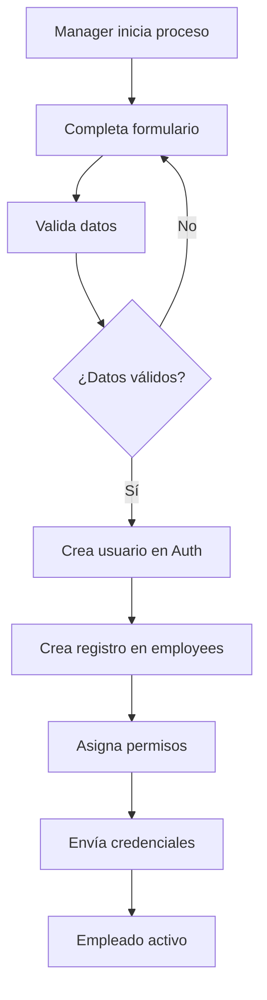
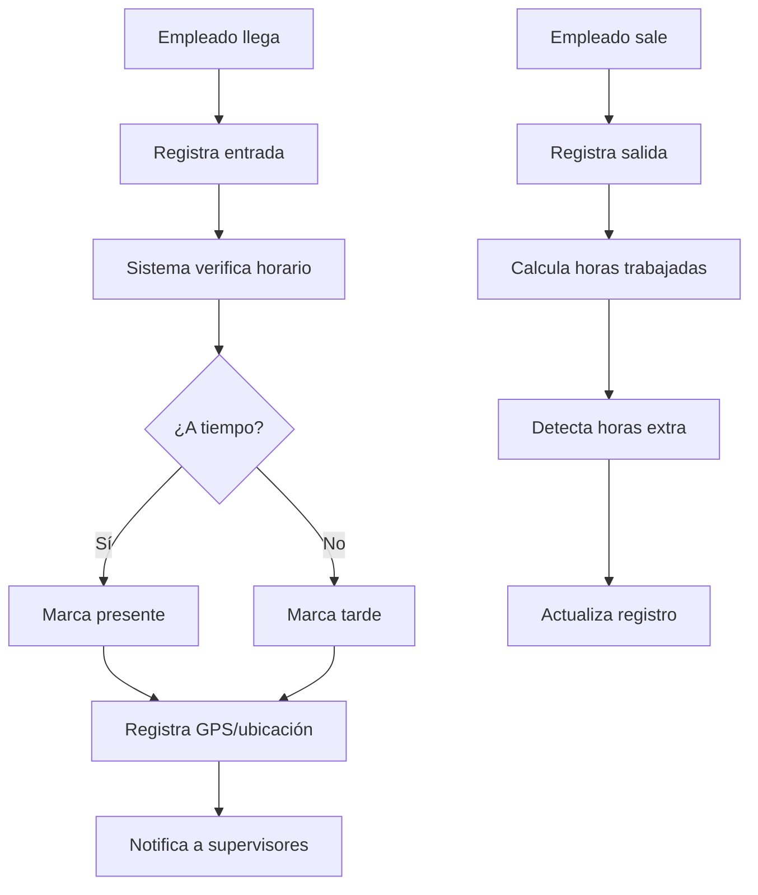

# 👥 SISTEMA DE EMPLEADOS ONTICKET

## 🎯 Visión General

El **Sistema de Empleados** de OnTicket permite a los clubs nocturnos gestionar su personal con un control granular de permisos, separando claramente las responsabilidades entre administradores y diferentes tipos de empleados.

## 🏗️ Arquitectura del Sistema

```
┌─────────────────────────────────────────────────────────┐
│                 EMPLOYEE MANAGEMENT                     │
├─────────────────────────────────────────────────────────┤
│  Admin Panel  │  Manager Tools  │  Employee Portal    │
├─────────────────────────────────────────────────────────┤
│            RBAC (Role-Based Access Control)           │
├─────────────────────────────────────────────────────────┤
│     Database Layer (RLS + Permissions Matrix)         │
└─────────────────────────────────────────────────────────┘
```

## 👨‍💼 Jerarquía de Roles

### 🎭 Definición de Roles

```typescript
export enum UserRole {
  // Roles de sistema
  SUPER_ADMIN = 'super_admin',    // Administrador del sistema completo
  
  // Roles de club
  CLUB_ADMIN = 'club_admin',      // Dueño/Admin principal del club
  MANAGER = 'manager',            // Gerente de operaciones
  SUPERVISOR = 'supervisor',      // Supervisor de turno
  CASHIER = 'cashier',           // Cajero/Punto de venta
  SECURITY = 'security',         // Seguridad/Porteros
  BARTENDER = 'bartender',       // Bartenders/Barra
  EMPLOYEE = 'employee'          // Empleado general
}
```

### 📊 Matriz de Responsabilidades

| Función | Club Admin | Manager | Supervisor | Cashier | Security | Bartender | Employee |
|---------|------------|---------|------------|---------|----------|-----------|----------|
| **👥 Gestión de Personal** |
| Contratar empleados | ✅ | ✅ | ❌ | ❌ | ❌ | ❌ | ❌ |
| Definir roles | ✅ | ✅ | ❌ | ❌ | ❌ | ❌ | ❌ |
| Asignar permisos | ✅ | ✅ | ❌ | ❌ | ❌ | ❌ | ❌ |
| Ver horarios | ✅ | ✅ | ✅ | ✅ | ✅ | ✅ | ✅ |
| **💰 Gestión Financiera** |
| Ver reportes completos | ✅ | ✅ | ❌ | ❌ | ❌ | ❌ | ❌ |
| Manejar caja fuerte | ✅ | ✅ | ✅ | ❌ | ❌ | ❌ | ❌ |
| Procesar ventas | ✅ | ✅ | ✅ | ✅ | ❌ | ❌ | ❌ |
| Ver transacciones | ✅ | ✅ | ✅ | ✅ | ❌ | ❌ | ❌ |
| **🎯 Operaciones** |
| Configurar eventos | ✅ | ✅ | ❌ | ❌ | ❌ | ❌ | ❌ |
| Gestionar inventario | ✅ | ✅ | ✅ | ❌ | ❌ | ✅ | ❌ |
| Control de acceso | ✅ | ✅ | ✅ | ❌ | ✅ | ❌ | ❌ |
| Atención al cliente | ✅ | ✅ | ✅ | ✅ | ✅ | ✅ | ✅ |

## 🛡️ Sistema de Permisos

### 🔐 Definición de Permisos

```typescript
export enum Permission {
  // === GESTIÓN DE USUARIOS ===
  VIEW_EMPLOYEES = 'employees:view',
  CREATE_EMPLOYEE = 'employees:create',
  UPDATE_EMPLOYEE = 'employees:update',
  DELETE_EMPLOYEE = 'employees:delete',
  MANAGE_ROLES = 'roles:manage',
  VIEW_USER_ACTIVITY = 'users:view_activity',
  
  // === GESTIÓN FINANCIERA ===
  VIEW_ACCOUNTS = 'accounts:view',
  CREATE_TRANSACTION = 'transactions:create',
  VIEW_TRANSACTIONS = 'transactions:view',
  MANAGE_CASH_REGISTER = 'cash:manage',
  VIEW_REPORTS = 'reports:view',
  EXPORT_FINANCIAL_DATA = 'finance:export',
  
  // === OPERACIONES ===
  MANAGE_EVENTS = 'events:manage',
  VIEW_EVENTS = 'events:view',
  MANAGE_INVENTORY = 'inventory:manage',
  VIEW_INVENTORY = 'inventory:view',
  ACCESS_CONTROL = 'access:control',
  
  // === CONFIGURACIÓN ===
  CLUB_SETTINGS = 'club:settings',
  SYSTEM_CONFIG = 'system:config',
  BACKUP_DATA = 'data:backup',
  
  // === REPORTES Y ANALYTICS ===
  VIEW_ANALYTICS = 'analytics:view',
  EXPORT_REPORTS = 'reports:export',
  VIEW_AUDIT_LOGS = 'audit:view'
}
```

### 🎯 Asignación de Permisos por Rol

```typescript
export const ROLE_PERMISSIONS: Record<UserRole, Permission[]> = {
  [UserRole.SUPER_ADMIN]: [
    // Acceso completo a todo el sistema
    ...Object.values(Permission)
  ],
  
  [UserRole.CLUB_ADMIN]: [
    // Gestión completa del club
    Permission.VIEW_EMPLOYEES,
    Permission.CREATE_EMPLOYEE,
    Permission.UPDATE_EMPLOYEE,
    Permission.DELETE_EMPLOYEE,
    Permission.MANAGE_ROLES,
    Permission.VIEW_USER_ACTIVITY,
    Permission.VIEW_ACCOUNTS,
    Permission.CREATE_TRANSACTION,
    Permission.VIEW_TRANSACTIONS,
    Permission.VIEW_REPORTS,
    Permission.EXPORT_FINANCIAL_DATA,
    Permission.MANAGE_EVENTS,
    Permission.VIEW_EVENTS,
    Permission.MANAGE_INVENTORY,
    Permission.VIEW_INVENTORY,
    Permission.ACCESS_CONTROL,
    Permission.CLUB_SETTINGS,
    Permission.VIEW_ANALYTICS,
    Permission.EXPORT_REPORTS,
    Permission.VIEW_AUDIT_LOGS
  ],
  
  [UserRole.MANAGER]: [
    // Gestión operativa
    Permission.VIEW_EMPLOYEES,
    Permission.CREATE_EMPLOYEE,
    Permission.UPDATE_EMPLOYEE,
    Permission.VIEW_USER_ACTIVITY,
    Permission.VIEW_ACCOUNTS,
    Permission.CREATE_TRANSACTION,
    Permission.VIEW_TRANSACTIONS,
    Permission.MANAGE_CASH_REGISTER,
    Permission.VIEW_REPORTS,
    Permission.MANAGE_EVENTS,
    Permission.VIEW_EVENTS,
    Permission.MANAGE_INVENTORY,
    Permission.VIEW_INVENTORY,
    Permission.ACCESS_CONTROL,
    Permission.VIEW_ANALYTICS
  ],
  
  [UserRole.SUPERVISOR]: [
    // Supervisión de turno
    Permission.VIEW_EMPLOYEES,
    Permission.VIEW_ACCOUNTS,
    Permission.CREATE_TRANSACTION,
    Permission.VIEW_TRANSACTIONS,
    Permission.MANAGE_CASH_REGISTER,
    Permission.VIEW_EVENTS,
    Permission.VIEW_INVENTORY,
    Permission.ACCESS_CONTROL
  ],
  
  [UserRole.CASHIER]: [
    // Operaciones de caja
    Permission.VIEW_ACCOUNTS,
    Permission.CREATE_TRANSACTION,
    Permission.VIEW_TRANSACTIONS,
    Permission.MANAGE_CASH_REGISTER,
    Permission.VIEW_EVENTS
  ],
  
  [UserRole.SECURITY]: [
    // Control de acceso
    Permission.ACCESS_CONTROL,
    Permission.VIEW_EVENTS,
    Permission.VIEW_EMPLOYEES
  ],
  
  [UserRole.BARTENDER]: [
    // Operaciones de barra
    Permission.VIEW_INVENTORY,
    Permission.VIEW_EVENTS,
    Permission.CREATE_TRANSACTION // Para ventas de bebidas
  ],
  
  [UserRole.EMPLOYEE]: [
    // Acceso básico
    Permission.VIEW_EVENTS
  ]
};
```

## 🗄️ Estructura de Base de Datos

### 📋 Esquema de Empleados

```sql
-- Extensión de la tabla existente de admins para incluir empleados
CREATE TABLE IF NOT EXISTS public.employees (
  id                uuid PRIMARY KEY DEFAULT gen_random_uuid(),
  user_id           uuid NOT NULL REFERENCES auth.users(id) ON DELETE CASCADE,
  club_id           uuid NOT NULL REFERENCES public.clubs(id) ON DELETE CASCADE,
  
  -- Información personal
  full_name         text NOT NULL,
  email             text NOT NULL UNIQUE,
  phone             text,
  date_of_birth     date,
  hire_date         date NOT NULL DEFAULT CURRENT_DATE,
  termination_date  date,
  
  -- Rol y permisos
  role              user_role NOT NULL,
  permissions       text[] NOT NULL DEFAULT '{}',
  status            employee_status NOT NULL DEFAULT 'active',
  
  -- Información laboral
  department        text,
  position_title    text,
  hourly_rate       numeric(8,2),
  salary_monthly    numeric(10,2),
  
  -- Configuración
  timezone          text DEFAULT 'America/Argentina/Buenos_Aires',
  language          text DEFAULT 'es',
  preferences       jsonb DEFAULT '{}',
  
  -- Metadatos
  created_at        timestamptz NOT NULL DEFAULT NOW(),
  updated_at        timestamptz NOT NULL DEFAULT NOW(),
  created_by        uuid REFERENCES auth.users(id),
  
  -- Constraints
  UNIQUE(club_id, email),
  CHECK (termination_date IS NULL OR termination_date >= hire_date)
);

-- Tipos enumerados para empleados
CREATE TYPE employee_status AS ENUM (
  'active',           -- Empleado activo
  'inactive',         -- Temporalmente inactivo
  'suspended',        -- Suspendido
  'terminated'        -- Despedido
);

-- Horarios de trabajo
CREATE TABLE IF NOT EXISTS public.employee_schedules (
  id                uuid PRIMARY KEY DEFAULT gen_random_uuid(),
  employee_id       uuid NOT NULL REFERENCES public.employees(id) ON DELETE CASCADE,
  
  -- Horario
  day_of_week       integer NOT NULL CHECK (day_of_week >= 0 AND day_of_week <= 6), -- 0=Domingo
  start_time        time NOT NULL,
  end_time          time NOT NULL,
  
  -- Configuración
  is_active         boolean NOT NULL DEFAULT true,
  effective_from    date NOT NULL DEFAULT CURRENT_DATE,
  effective_until   date,
  
  -- Metadatos
  created_at        timestamptz NOT NULL DEFAULT NOW(),
  updated_at        timestamptz NOT NULL DEFAULT NOW(),
  
  -- Constraints
  UNIQUE(employee_id, day_of_week, effective_from),
  CHECK (end_time > start_time OR (start_time > end_time)) -- Permite turnos nocturnos
);

-- Registro de asistencia
CREATE TABLE IF NOT EXISTS public.employee_attendance (
  id                uuid PRIMARY KEY DEFAULT gen_random_uuid(),
  employee_id       uuid NOT NULL REFERENCES public.employees(id) ON DELETE CASCADE,
  
  -- Registro
  check_in_time     timestamptz NOT NULL,
  check_out_time    timestamptz,
  date              date NOT NULL,
  
  -- Información adicional
  check_in_method   text DEFAULT 'manual', -- manual, qr, biometric
  check_out_method  text,
  location          point, -- GPS coordinates
  notes             text,
  
  -- Estado
  status            attendance_status NOT NULL DEFAULT 'present',
  hours_worked      numeric(4,2),
  overtime_hours    numeric(4,2) DEFAULT 0,
  
  -- Metadatos
  created_at        timestamptz NOT NULL DEFAULT NOW(),
  updated_at        timestamptz NOT NULL DEFAULT NOW(),
  
  -- Constraints
  UNIQUE(employee_id, date),
  CHECK (check_out_time IS NULL OR check_out_time > check_in_time)
);

CREATE TYPE attendance_status AS ENUM (
  'present',          -- Presente
  'absent',           -- Ausente
  'late',            -- Llegó tarde
  'early_leave',     -- Salió temprano
  'overtime'         -- Horas extras
);
```

### 🔒 Row Level Security para Empleados

```sql
-- Habilitar RLS en las nuevas tablas
ALTER TABLE public.employees ENABLE ROW LEVEL SECURITY;
ALTER TABLE public.employee_schedules ENABLE ROW LEVEL SECURITY;
ALTER TABLE public.employee_attendance ENABLE ROW LEVEL SECURITY;

-- Función helper para obtener el employee_id del usuario actual
CREATE OR REPLACE FUNCTION public.current_employee_id()
RETURNS uuid AS $$
  SELECT id FROM public.employees 
  WHERE user_id = auth.uid() AND status = 'active'
$$ LANGUAGE sql SECURITY DEFINER;

-- Función helper para verificar si el usuario puede gestionar empleados
CREATE OR REPLACE FUNCTION public.can_manage_employees()
RETURNS boolean AS $$
  SELECT EXISTS (
    SELECT 1 FROM public.employees e
    WHERE e.user_id = auth.uid() 
    AND e.status = 'active'
    AND e.role IN ('club_admin', 'manager')
  )
$$ LANGUAGE sql SECURITY DEFINER;

-- Políticas para employees
CREATE POLICY "employees_select_own_club" ON public.employees
  FOR SELECT TO authenticated
  USING (club_id = current_user_club_id());

CREATE POLICY "employees_insert_managers_only" ON public.employees
  FOR INSERT TO authenticated
  WITH CHECK (
    can_manage_employees() 
    AND club_id = current_user_club_id()
  );

CREATE POLICY "employees_update_managers_only" ON public.employees
  FOR UPDATE TO authenticated
  USING (
    can_manage_employees() 
    AND club_id = current_user_club_id()
  )
  WITH CHECK (
    can_manage_employees() 
    AND club_id = current_user_club_id()
  );

-- Los empleados pueden ver sus propios horarios
CREATE POLICY "schedules_select_own_or_managers" ON public.employee_schedules
  FOR SELECT TO authenticated
  USING (
    employee_id = current_employee_id() 
    OR can_manage_employees()
  );

-- Solo managers pueden gestionar horarios
CREATE POLICY "schedules_manage_managers_only" ON public.employee_schedules
  FOR ALL TO authenticated
  USING (can_manage_employees())
  WITH CHECK (can_manage_employees());

-- Los empleados pueden registrar su asistencia
CREATE POLICY "attendance_own_records" ON public.employee_attendance
  FOR ALL TO authenticated
  USING (
    employee_id = current_employee_id()
    OR can_manage_employees()
  )
  WITH CHECK (
    employee_id = current_employee_id()
    OR can_manage_employees()
  );
```

## 🎨 Frontend - Componentes Principales

### 🧩 Estructura de Componentes

```
src/features/employees/
├── components/
│   ├── EmployeeList.tsx           # Lista principal de empleados
│   ├── EmployeeForm.tsx           # Formulario crear/editar
│   ├── EmployeeCard.tsx           # Tarjeta individual
│   ├── PermissionMatrix.tsx       # Matriz de permisos
│   ├── ScheduleManager.tsx        # Gestión de horarios
│   ├── AttendanceTracker.tsx      # Control de asistencia
│   └── EmployeeDashboard.tsx      # Dashboard personal
├── hooks/
│   ├── useEmployees.ts            # Hook principal
│   ├── usePermissions.ts          # Manejo de permisos
│   ├── useSchedules.ts            # Horarios
│   └── useAttendance.ts           # Asistencia
├── services/
│   ├── employeeService.ts         # API de empleados
│   ├── permissionService.ts       # Lógica de permisos
│   └── attendanceService.ts       # API de asistencia
└── types/
    └── employee.ts                # Tipos TypeScript
```

### 🎯 Hook de Permisos

```typescript
// hooks/usePermissions.ts
export const usePermissions = () => {
  const { user } = useAuth();
  
  const hasPermission = useCallback((permission: Permission): boolean => {
    if (!user) return false;
    
    // Super admin tiene todos los permisos
    if (user.role === UserRole.SUPER_ADMIN) return true;
    
    // Verificar permisos específicos del rol
    const rolePermissions = ROLE_PERMISSIONS[user.role] || [];
    return rolePermissions.includes(permission);
  }, [user]);
  
  const hasAnyPermission = useCallback((permissions: Permission[]): boolean => {
    return permissions.some(permission => hasPermission(permission));
  }, [hasPermission]);
  
  const hasAllPermissions = useCallback((permissions: Permission[]): boolean => {
    return permissions.every(permission => hasPermission(permission));
  }, [hasPermission]);
  
  const canManageEmployee = useCallback((employee: Employee): boolean => {
    // No puede gestionarse a sí mismo (excepto super admin)
    if (employee.userId === user?.id && user.role !== UserRole.SUPER_ADMIN) {
      return false;
    }
    
    // Solo puede gestionar empleados de menor jerarquía
    const currentRoleLevel = getRoleHierarchyLevel(user?.role);
    const targetRoleLevel = getRoleHierarchyLevel(employee.role);
    
    return currentRoleLevel < targetRoleLevel && hasPermission(Permission.UPDATE_EMPLOYEE);
  }, [user, hasPermission]);
  
  return {
    hasPermission,
    hasAnyPermission,
    hasAllPermissions,
    canManageEmployee
  };
};

// Jerarquía de roles (menor número = mayor autoridad)
const getRoleHierarchyLevel = (role: UserRole): number => {
  const hierarchy = {
    [UserRole.SUPER_ADMIN]: 0,
    [UserRole.CLUB_ADMIN]: 1,
    [UserRole.MANAGER]: 2,
    [UserRole.SUPERVISOR]: 3,
    [UserRole.CASHIER]: 4,
    [UserRole.SECURITY]: 4,
    [UserRole.BARTENDER]: 4,
    [UserRole.EMPLOYEE]: 5
  };
  
  return hierarchy[role] ?? 999;
};
```

### 🛡️ Componente de Protección

```typescript
// components/PermissionGuard.tsx
interface PermissionGuardProps {
  permission: Permission | Permission[];
  mode?: 'any' | 'all'; // Para arrays de permisos
  fallback?: React.ReactNode;
  children: React.ReactNode;
}

export const PermissionGuard: React.FC<PermissionGuardProps> = ({
  permission,
  mode = 'any',
  fallback = null,
  children
}) => {
  const { hasPermission, hasAnyPermission, hasAllPermissions } = usePermissions();
  
  const hasAccess = useMemo(() => {
    if (Array.isArray(permission)) {
      return mode === 'any' 
        ? hasAnyPermission(permission)
        : hasAllPermissions(permission);
    }
    return hasPermission(permission);
  }, [permission, mode, hasPermission, hasAnyPermission, hasAllPermissions]);
  
  if (!hasAccess) {
    return <>{fallback}</>;
  }
  
  return <>{children}</>;
};

// Uso del componente
<PermissionGuard 
  permission={Permission.CREATE_EMPLOYEE}
  fallback={<div>No tienes permisos para ver esta sección</div>}
>
  <CreateEmployeeButton />
</PermissionGuard>
```

## 🔄 Flujos de Trabajo

### 👨‍💼 Alta de Empleado



### ⏰ Control de Asistencia



## 📊 Dashboard y Reportes

### 🎯 Dashboard de Manager

```typescript
// components/ManagerDashboard.tsx
export const ManagerDashboard: React.FC = () => {
  const { employees, loading } = useEmployees();
  const { attendanceToday } = useAttendance();
  const { permissions } = usePermissions();
  
  return (
    <div className="space-y-6">
      {/* KPIs principales */}
      <div className="grid grid-cols-4 gap-4">
        <StatCard
          title="Empleados Activos"
          value={employees.filter(e => e.status === 'active').length}
          icon={<Users />}
        />
        <StatCard
          title="Presentes Hoy"
          value={attendanceToday.filter(a => a.status === 'present').length}
          icon={<Clock />}
        />
        <StatCard
          title="Llegadas Tarde"
          value={attendanceToday.filter(a => a.status === 'late').length}
          icon={<AlertTriangle />}
          variant="warning"
        />
        <StatCard
          title="Horas Extra"
          value={attendanceToday.reduce((sum, a) => sum + (a.overtimeHours || 0), 0)}
          icon={<TrendingUp />}
        />
      </div>
      
      {/* Lista de empleados */}
      <PermissionGuard permission={Permission.VIEW_EMPLOYEES}>
        <Card>
          <CardHeader>
            <CardTitle>Personal del Club</CardTitle>
          </CardHeader>
          <CardContent>
            <EmployeeList employees={employees} />
          </CardContent>
        </Card>
      </PermissionGuard>
      
      {/* Control de asistencia en tiempo real */}
      <PermissionGuard permission={Permission.VIEW_USER_ACTIVITY}>
        <Card>
          <CardHeader>
            <CardTitle>Asistencia en Vivo</CardTitle>
          </CardHeader>
          <CardContent>
            <AttendanceTracker />
          </CardContent>
        </Card>
      </PermissionGuard>
    </div>
  );
};
```

### 📈 Reportes de Personal

```typescript
// services/reportingService.ts
export class EmployeeReportingService {
  async generateAttendanceReport(
    clubId: string, 
    startDate: Date, 
    endDate: Date
  ): Promise<AttendanceReport> {
    const { data, error } = await supabase
      .rpc('generate_attendance_report', {
        p_club_id: clubId,
        p_start_date: startDate.toISOString(),
        p_end_date: endDate.toISOString()
      });
    
    if (error) throw error;
    return data;
  }
  
  async getEmployeePerformanceMetrics(
    employeeId: string,
    period: 'month' | 'quarter' | 'year'
  ): Promise<PerformanceMetrics> {
    // Implementación de métricas de rendimiento
    return {
      attendanceRate: 95.5,
      punctualityRate: 88.2,
      overtimeHours: 12.5,
      customerFeedbackScore: 4.2,
      salesPerformance: 105.8 // % del objetivo
    };
  }
}
```

## 📱 Experiencia del Empleado

### 🏠 Portal del Empleado

```typescript
// components/EmployeePortal.tsx
export const EmployeePortal: React.FC = () => {
  const { employee } = useAuth();
  const { todaySchedule } = useSchedules();
  const { checkIn, checkOut, isCheckedIn } = useAttendance();
  
  return (
    <div className="max-w-md mx-auto space-y-6">
      {/* Header personalizado */}
      <div className="text-center">
        <h1 className="text-2xl font-bold">¡Hola, {employee.fullName}!</h1>
        <p className="text-gray-600">{format(new Date(), 'EEEE, d MMMM yyyy', { locale: es })}</p>
      </div>
      
      {/* Check-in/out */}
      <Card>
        <CardContent className="pt-6">
          <div className="text-center space-y-4">
            <Clock className="mx-auto h-12 w-12 text-blue-500" />
            <div>
              <p className="text-sm text-gray-600">Tu turno</p>
              <p className="text-lg font-semibold">
                {todaySchedule?.startTime} - {todaySchedule?.endTime}
              </p>
            </div>
            <Button
              onClick={isCheckedIn ? checkOut : checkIn}
              className={`w-full ${isCheckedIn ? 'bg-red-500 hover:bg-red-600' : 'bg-green-500 hover:bg-green-600'}`}
            >
              {isCheckedIn ? 'Marcar Salida' : 'Marcar Entrada'}
            </Button>
          </div>
        </CardContent>
      </Card>
      
      {/* Información rápida */}
      <div className="grid grid-cols-2 gap-4">
        <Card>
          <CardContent className="pt-4">
            <div className="text-center">
              <Calendar className="mx-auto h-8 w-8 text-blue-500 mb-2" />
              <p className="text-sm text-gray-600">Este Mes</p>
              <p className="text-xl font-bold">22 días</p>
            </div>
          </CardContent>
        </Card>
        
        <Card>
          <CardContent className="pt-4">
            <div className="text-center">
              <TrendingUp className="mx-auto h-8 w-8 text-green-500 mb-2" />
              <p className="text-sm text-gray-600">Puntualidad</p>
              <p className="text-xl font-bold">95%</p>
            </div>
          </CardContent>
        </Card>
      </div>
    </div>
  );
};
```

## 🔧 Configuración e Implementación

### 🚀 Pasos de Implementación

1. **Base de Datos**
   ```bash
   # Ejecutar migraciones SQL
   psql -h your-db-host -d your-db -f employee_schema.sql
   ```

2. **Backend (Supabase Functions)**
   ```typescript
   // Función para crear empleado
   export const createEmployee = async (employeeData: CreateEmployeeData) => {
     // Validación y creación
   };
   ```

3. **Frontend Components**
   ```bash
   # Generar componentes base
   npx shadcn-ui@latest add form table badge
   ```

### ⚙️ Variables de Configuración

```typescript
// config/employee.config.ts
export const EMPLOYEE_CONFIG = {
  // Límites de sistema
  MAX_EMPLOYEES_PER_CLUB: 100,
  MAX_PERMISSIONS_PER_EMPLOYEE: 25,
  
  // Configuración de asistencia
  LATE_THRESHOLD_MINUTES: 15,
  OVERTIME_THRESHOLD_HOURS: 8,
  GPS_ACCURACY_METERS: 50,
  
  // Configuración de horarios
  DEFAULT_SHIFT_HOURS: 8,
  MAX_CONSECUTIVE_DAYS: 6,
  MIN_REST_HOURS: 12
};
```

## 📋 Checklist de Implementación

### ✅ Fase 1 - Fundación (Semana 1-2)
- [x] Diseño de base de datos
- [x] Esquemas SQL y migraciones
- [x] Definición de roles y permisos
- [x] Configuración RLS
- [ ] Tests de seguridad básicos

### 🔄 Fase 2 - Core Features (Semana 3-4)
- [ ] CRUD de empleados
- [ ] Sistema de permisos
- [ ] Gestión de horarios
- [ ] Control de asistencia básico

### 🚀 Fase 3 - UX y Features Avanzadas (Semana 5-6)
- [ ] Dashboard de empleados
- [ ] Portal personal
- [ ] Reportes y analytics
- [ ] Notificaciones
- [ ] App móvil básica

### 🔧 Fase 4 - Optimización (Semana 7-8)
- [ ] Performance optimization
- [ ] Tests completos
- [ ] Documentación final
- [ ] Capacitación usuarios

---

**Próxima revisión**: 2025-02-15
**Responsable**: Equipo OnTicket
**Estado**: En desarrollo